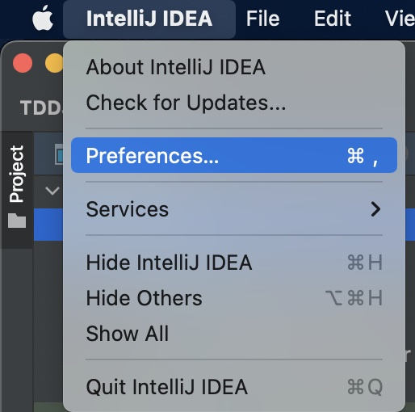
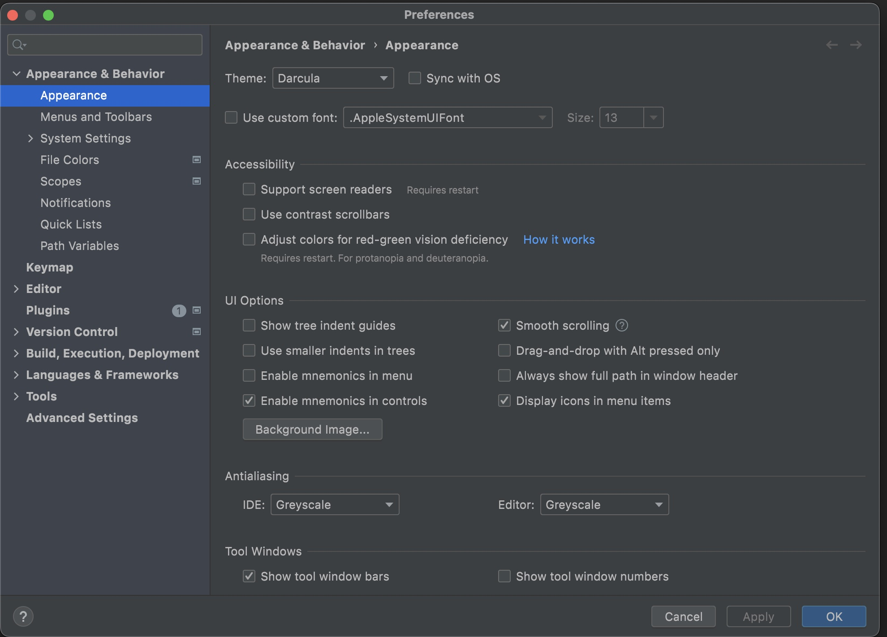
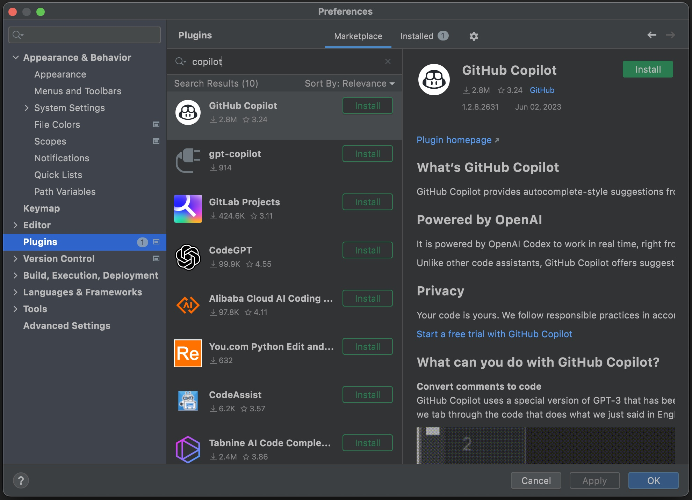
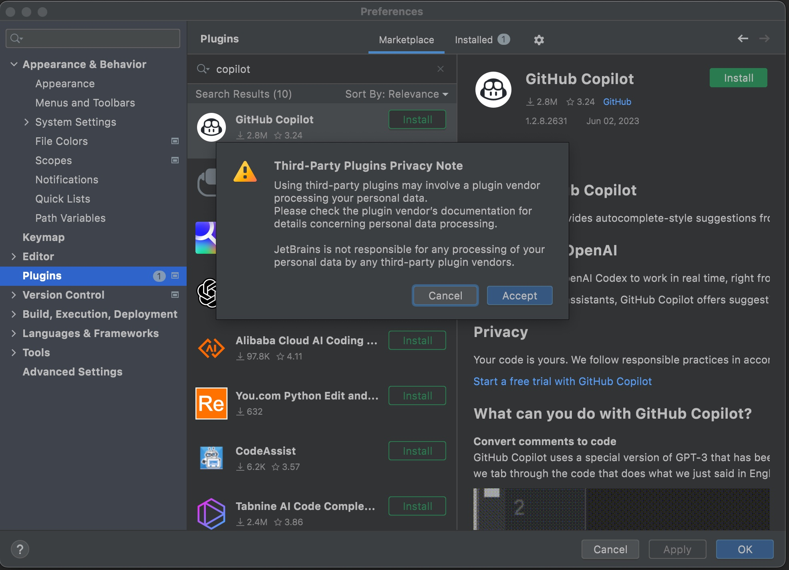
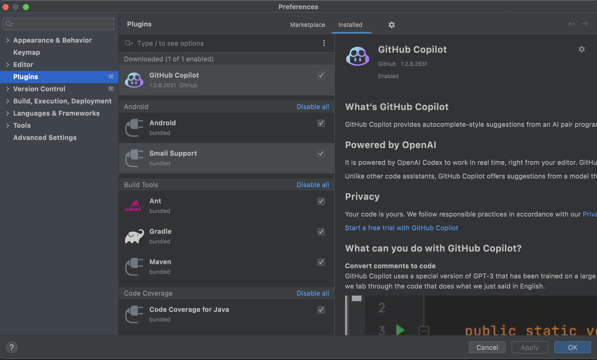

# How to install Copilot Extension for IntelliJ IDE

This shows how to install Copilot Extension for IntelliJ IDE. You need to install IntelliJ IDE first before you can install Copilot Extension for IntelliJ IDE.

## Step 1: Install IntelliJ IDE

You need to make sure that you installed **IntelliJ IDE** before installing Copilot extension for IntelliJ

[Download IntelliJ](https://www.jetbrains.com/idea/download)

## Step 2: Go to Preferences

In your IntelliJ IDE, go to **Preferences**.

## Step 3: Search for Copilot Extension in IntelliJ and install

You will see the **Preferences** window.

Next, go to **Plugins** and search for **Copilot**. You should see **GitHub Copilot** extension in the search result. 

Click on **Install** button to install the extension. You need to accept the term.

## Step 4: Restart IntelliJ IDE

You need to restart IntelliJ IDE after installing the extension. Then, when you come back, you should see that Copilot Extension is installed.

